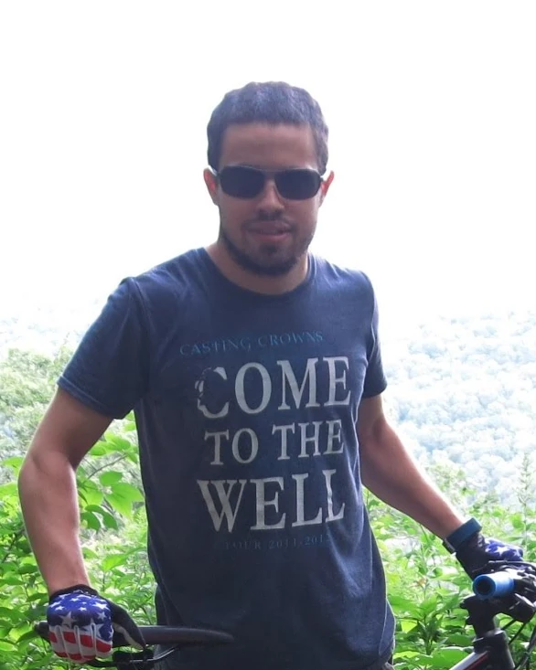

+++
date = "2025-05-09T21:57:54-04:00"
title = "About Us"
description = "Gilluly IT Service's history in Belmont, NY as a part time computer repair business."
[menu]
[menu.main]
weight = 4
+++

Originally started in 2009 by two Genesee Valley Central School students, Dilan Gilluly and Jacob Burrows under the name Computer Repair 4 Less. It was a means to take on some learning projects and to earn technical endorsements on said diplomas.

By 2010, it was official; filed under a DBA and a tax ID was received. Computer Repair 4 Less continued to operate until 2012, when Jacob moved on to other employment opportunities.

The assets of the business were assumed by Dilan Gilluly, during the founding of this business, Gilluly IT Services, LLC, in October of 2012. And ever since then he has been operating the business part time. At first in between shifts as a cleaner at Belmont BOCES. Then in 2014, Dilan was hired at Alfred State College as a Client Services Technician.

To this day, Gilluly IT Services is based out of Belmont, NY.

## About the Owner

Born from a family with Irish lineage, with a lot of tradesmen, mostly electricians; Dilan Gilluly decided to get into computers at a young age. Building his first computer at the age of 13 years old, which was equipped with an AMD Athlon 64 3500+ CPU. Most of the parts for the build were gifts from his family.

Using said computer Dilan learned HTML and CSS website design, as well as VB.Net programming. These skills not only transitioned into doing computer work on contract, but by 2017, Dilan started making a Microsoft Access database application using quite a bit of VBA programming, for the annual SPCA Serving Allegany County Theme Basket Auction. While said database application is now Python based, it still is maintained mostly by Dilan Gilluly.

During his spare time Dilan likes to stay in shape, listen to various kinds of music, and explore various destinations via mountain bike.

