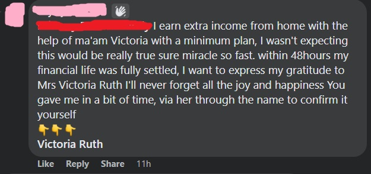
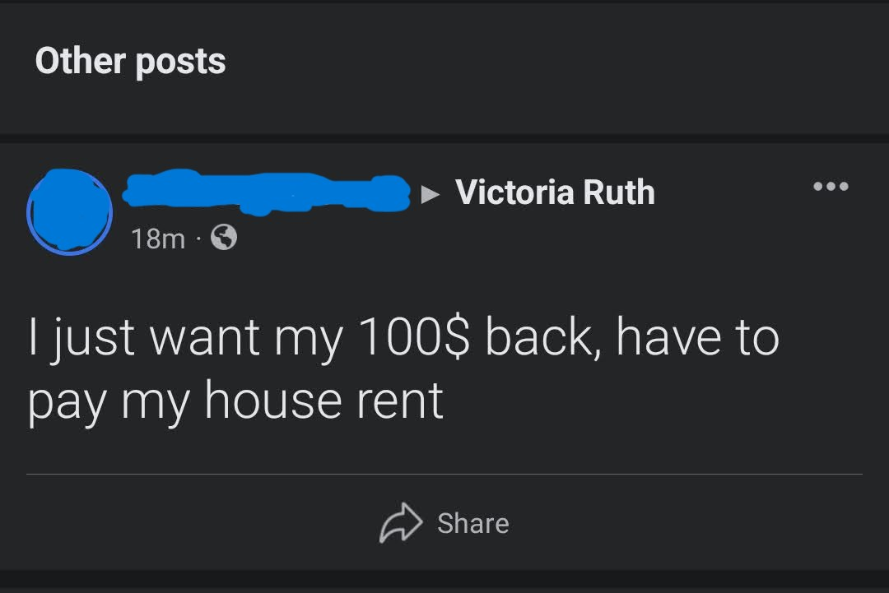
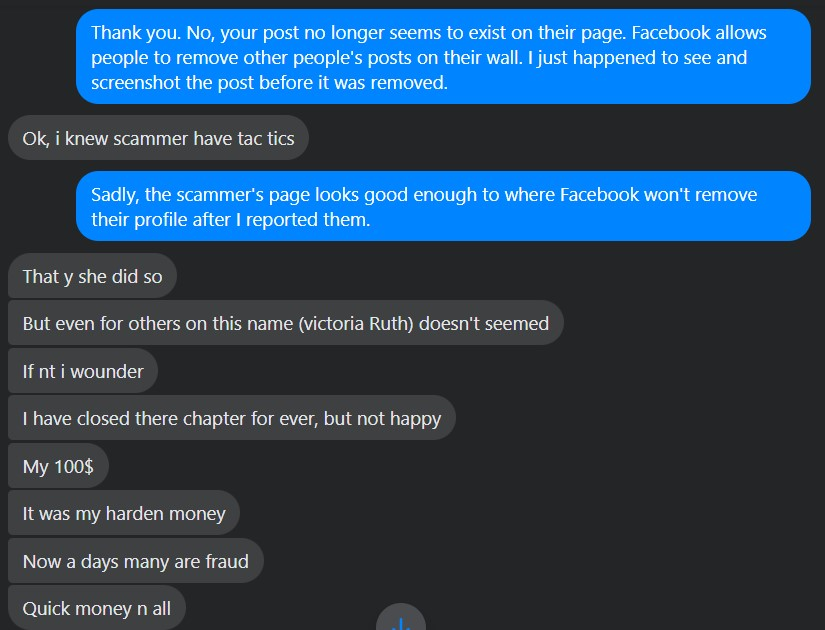
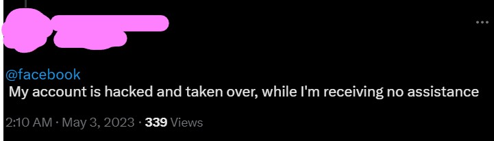

One of the things I encountered while on Facebook, was a bunch of spam messages about some Bitcoin Forex guru. So I decided to take a look into the profile, and found a few red flags, pointing to it possibly being a scam.

## The repeat comments

It didn't really matter where I looked in several groups, these individuals were replying constantly to other comments with the same canned message over and over again. It got to the point where Facebook's default filter set, "Most relevant" was actually not showing such replies. I had to click the dropdown, and switch it to "All Comments" just to be able to see them.

More on this later but I mainly suspected at the time that these comments were coming from stolen accounts, so to potential marks, it appeared that such comments were coming from legitimate accounts.

## Finding a victim

Most of these scammers on Facebook continually monitor their own profiles and remove any negative posts or comments. It's one of the things you can do to differentiate between a legitimate business and a scam.

* **Legitimate Businesses** - Most of the time will leave negative comments up on their pages, then just respond to said comments with a "Please DM us so we can help you out more." Unless such posts are threatening or otherwise disruptive.
* **Scam Businesses** - Most of the time will outright remove all negative posts and comments on their profiles.

But in a strange twist of fate I ended up seeing a negative post on the scammer's page while looking, which I then messaged the victim to get their side of the story.

Essentially to make a long story short, the victim in this case deposited $100 with the scammer, then complained when they didn't get the promised return in the promised timeframe. When the scammer asked them to deposit $650 more to make more of a return, they realized it was a scam then made the post on the scammer's page. While I was typing out my introductory message, the scammer removed that post.

That's the major, major issue with these scams. Most of the time their victims don't realize it's a scam until some time after they've lost money to them. In many cases, it's a life-altering amount.

## Stolen Accounts

In many cases for these scams, the accounts used to pitch them are stolen from people. Typically using the code generator method after making a duplicate account of one of their friends. Other times talking folks into sharing their security question answers or passwords.

One of the accounts I had found which was pitching the spam comment for this particular scammer, posted on Facebook's Twitter page, to the effect of them not being able to log into their account. Facebook support was unresponsive to them, which is why they took to Twitter which was also unresponsive for them.

I suspect Facebook ignores these requests because these folks will eventually be forced to make new Facebook profiles, which adds to the number of profiles Facebook has, which increases their perceived value to shareholders. How else does one explain a multibillion dollar corporation not doing a verification check before an account changes its primary/recovery email? When even small business' shopping sites have said feature.

With that fact aside, it's up to the scammer to allow folks back into their accounts. But most of the time the scammers will force them to post positive reviews, sometimes with pictures and videos of themselves reading a script or holding a fake check or their own money (which wasn't earned through the 'trading' scheme). Likely the victims will never get their accounts back or for short times to post the positive reviews.

## How can you protect yourself

Main thing is that if something sounds too good to be true, it likely is.

Same goes for investments, including forex ones. Ones guaranteeing returns on an investment by factors of 10 in relatively short periods of time, would be a high-risk investment by nature. Which means there's nothing guaranteed about it. Which is why many legitimate trading outlets don't **guarantee** returns, especially for anything "high-risk."

As for preventing your account from being stolen and used to perpetuate these scams, be very careful when dealing with a second account which was opened up in your friends' name. If you know their email or phone number, it's a good idea to reach out to them in such a scenario to verify the new account is them.

There are some people who for some reason like to have multiple accounts on each social media, so it's not as simple as "avoid all duplicate accounts."

If you do engage in conversations with said duplicate accounts, remember, if they ask you to generate a code for them to get into their old account, the code will get them into **your** account and not another persons'.

The following Youtube video is a good watch which explains this specific scam, and goes into detail on an inside look at how it operates.

[Link to the Youtube video](https://youtu.be/zj1_RYNF7nM)