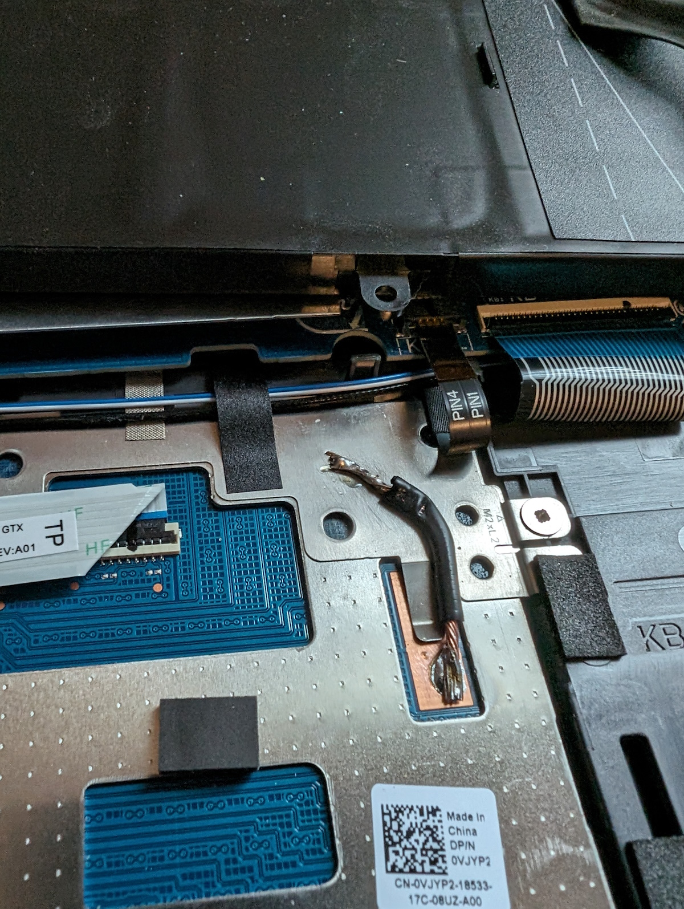

+++
date = '2024-03-17T15:35:59-04:00'
draft = false
title = 'Dell Inpiron 16 Touchpad'
+++

So here comes a fun one, a big reason why strong right-to-repair laws should be enacted and preserved.

Anyway, this laptop comes to me from a long-time client of mine, a Dell Inspiron 16 Plus. Chief complaint is popups and a jumpy touchpad. So I look at it. The popups were caused by the expired McAfee trial and I got rid of that. But my efforts were lengthened by the fact that the touchpad would "jump" when I'd go to click on something.

Sure enough, I do some research into it to find out that it is a grounding issue with the touchpad. Which the repair is shown quite well in [this video](https://youtu.be/4xGq5gmKEAA?si=4CISUr7HJW__HEfR).

## The hiccup

When trying to conduct the same repair with the particular Inspiron 16 Plus that I had, which is a bit newer than the one in the video, Dell had made the screws shorter which surrounded the touchpad. So even with a small copper wire obtained by separating stranded primary wire, wouldn't fit under the screw while trying to screw it in.

Whether this was an anti repair move, I have no idea, but it very well could be.

Now a rational company would have just fixed the issue instead of making it nearly impossible to fix it post-manufacturing. Some people may defend that it's the company's right, but I think it's slimy.

## How I fixed it (for now)

For now I was able to get the actual plate hot and clean enough for some wire and a solder to bond to it. I went with a full primary wire because it fit between the battery and touchpad relatively well still, is insulated, and gives a bigger surface area for the bonding.

We'll have to see if that holds up.