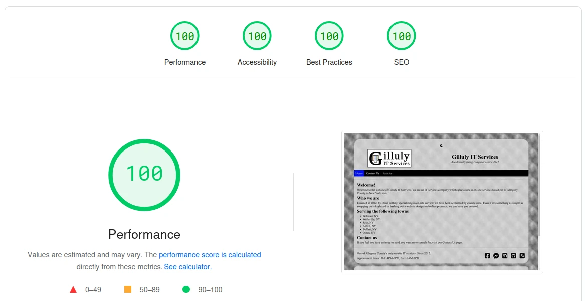
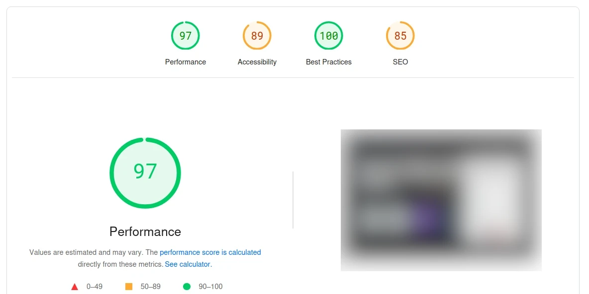
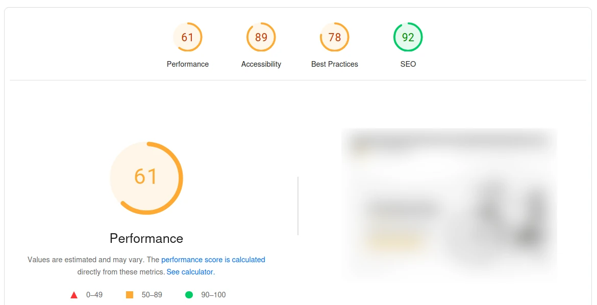

+++
date = "2025-04-10T17:23:21-04:00"
title = "Why?"
draft = false
+++

Maybe it's odd for me to optimize and run sites on Hugo, but I do enjoy it. There's just a gratification in making your own theme from the ground up and getting high scores on performance analyses.

One would think that just having a website in the first place would thwart off a barrage of emails from web developers and SEO professionals who somehow don't get blacklisted emailing to everyone that they can find an email for off of any website.

<!--more-->

Even if said website has this notice on it:

Or the fact that I have an easter egg on this site that you can only read by using devtools or viewing the source.

No, that is not enough to stop the spam.

## To the SEO individuals

This site already ranks in-between the slew of social media sites, as well as review conglomerates, which Google and others prioritize by default. And the one SEO firm that got a company to rank better than this site, is supporting a company that offers nationwide remote data recovery, and no, it's not a mail-in service.

If you don't see the issue in that then it's time for you to hang up your hat as a tech professional.

Especially if you're using a Yahoo, Gmail, Hotmail, or any free residential email platform. Like it's 2025. It's pretty easy to setup email on a custom domain using a reputable provider like Microsoft 365.

I did track down an agency who critiqued my site pretty hard, whose employee called me on my cell phone. And compared my site to theirs on the PageSpeed (the one by Google) performance and SEO rankings. They made the mistake of mentioning their agency by name.

Results for this site:

And the results of their own website.

So if you're going to go out of your way to potential clients who have 100's in SEO already, then you should optimize your site enough so you don't score fifteen points **lower** than those you're advertising to.

## To the web designers

My Hugo site performs well enough to where I'm willing to put its source on the web for the entire Github community to critique. And no, even if I have a change of heart and go back to Wordpress, I don't need to hire someone to throw a free or half-baked in-house theme onto it for me.

If I wanted a site that performed this poorly I would have skipped the middleman and put a non-deferred sleep timer script in my template files.

Also, even Fortune 500's don't get that low of a score on Best Practices usually, that takes real talent.

The good news is that you could give the SEO agency a lesson or two in SEO.

And no, Hugo isn't that hard to operate or even update content. It's easily done with a script, that's a 3 liner. I'll even do it on video to show my potential clients how easy it can be.

## The main lesson

The main lesson here is you shouldn't advertise to small businesses, the same services they offer. It's time tech companies start practicing the professional etiquette other industries have.

You don't see mechanics showing up to other mechanic shops saying things like "It's time a real mechanic worked here." Or, "Hey, take it to my shop. We'll fix it better or cheaper than you can."

Well, not unless they want a wrench thrown at them.

