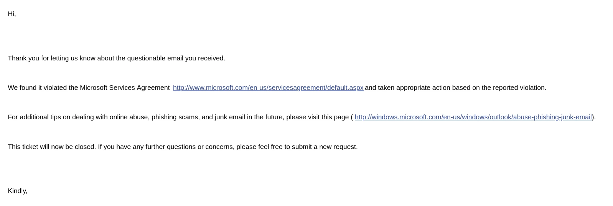

+++
title = "How we're reducing spam"
date = "2025-11-21T13:33:15-05:00"
draft = false
+++

After continually getting spam from supposed web designers or SEO experts (those who don't have websites or even domains of their own, keep in mind), I decided to do research into it because of the following.

Most of the emails were coming from addresses with domains set aside for free accounts.

<!--more-->

So I looked at the terms and conditions of those providers:

- Google/Gmail:
  - "Don’t use Gmail to distribute spam or unsolicited commercial mail. You are not allowed to use Gmail to send email in violation of the CAN-SPAM Act or other anti-spam laws; to send unauthorized email via open, third-party servers; or to distribute the email addresses of any person without their consent.You are not allowed to automate the Gmail interface, whether to send, delete, or filter emails, in a manner that misleads or deceives users."
- Microsoft/Outlook/Hotmail:
    - "Microsoft does not tolerate any form of spam on our platforms or services. Spam is any content that is excessively posted, repetitive, untargeted, unwanted or unsolicited. 

        Examples of prohibited spam practices include:

        - Sending unsolicited messages to users or posting comments that are commercial, repetitive, or deceptive. 
        - Using titles, thumbnails, descriptions, or tags to mislead users into believing the content is about a different topic or category than it is.
        - Sending unwanted or unsolicited bulk email, postings, contact requests, SMS messages, instant messages, or similar electronic communications.
        - Using deceptive or abusive tactics to attempt to deceive or manipulate ranking or other algorithmic systems, including link spamming, social media schemes, cloaking, or keyword stuffing. "

With all this in mind, there's ways to reduce the amout of this spam in a way that would have an effect in how much of it anyone in this industry receives, just by reporting their violating content to their service providers and having their accounts shut off or rate limited.

## The Method

The way I figured out how to report the content is dependent on the email provider **of the sender**. So if you want to join the movement, here they are below:

- Microsoft Outlook (outlook.com), Hotmail (hotmail.com)
  - Email a copy of the email, including headers, attached to abuse@outlook.com
- Google's Gmail (gmail.com)
  - Fill out the form here: [Gmail Abuse Form](https://support.google.com/mail/contact/abuse)

## The test

As soon as I decided to start doing this, I get an email from an outlook.com account. So I downloaded it from my email client as a .eml file, then attached it and sent to the abuse@outlook.com address.

A few days later I get the following:

# A Promise

So a promise to those who keep sending spam emails to me others others despite no solicitation notices on the contact pages, I'll do everything in my power to slow you down. Including this.